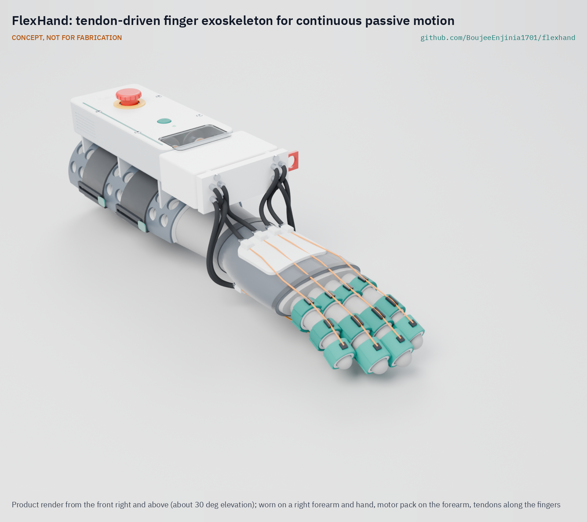

# FlexHand

     

**Area:** BioMedical · **TRL:** 3 of 9 (proof of concept on paper) · **Value-engineering target:** USD 500 (estimated cost USD 304) · **Difficulty:** 4 of 5

Soft-actuated finger exoskeleton for continuous passive motion, driven by tendons from a wrist-mounted motor pack.

[Exploded render](media/render-exploded.png) · [Detail render](media/render-detail.png) · [Interactive 3D model](media/viewer.html) · [Concept blueprint (PDF)](media/concept-blueprint.pdf) · [General arrangement (PDF)](cad/drawings/FXH-DWG-001.pdf) · [Sizing calculations](docs/04-calcs/01-sizing.md) · [Prototype build plan](docs/05-build-plan.md) · [Design decisions](docs/06-design-decisions.md) · [Review note](docs/REVIEW.md)

## Concept rationale

Repetition is the scarce input in hand rehabilitation after stroke, and the scarce resource that delivers it is therapist time. A device that moves the fingers slowly through a therapist-set range, hundreds of times per session, can add dose at home without adding therapist hours. Tendons pulled through Bowden sheaths from a forearm pack keep the hand side light (about 117 g) and put the motors, cells and electronics where their mass matters least, which is why FlexHand uses tendons rather than a pneumatic glove or motors on the hand.

FlexHand is open and garage-buildable because the users who most need low-cost dose are least served by clinic-bound robotic gloves. Two off-the-shelf gearmotors, carrier-board electronics, 3D-printed TPU and PETG parts and bicycle shift housing keep the parts cost near USD 304 and let a research group, a clinic workshop or a makerspace build, inspect and adapt it. Openness also lets others check the safety layers (current limit, breakaway couplings, hardware stop and tool-free release) rather than trusting them. It is a research and educational prototype, not a medical device.

## Burning platform

Stroke is common, rising and concentrated where rehabilitation is thinnest. The Global Burden of Disease study counted 11.9 million new strokes and 93.8 million people living after a stroke in 2021, up 70 % and 86 % since 1990, with more than three-quarters of those affected living in low- and middle-income countries ([IHME, on the GBD 2021 stroke analysis in *The Lancet Neurology*, 2024](https://www.healthdata.org/news-events/newsroom/news-releases/lancet-neurology-air-pollution-high-temperatures-and-metabolic)). In many of those settings there are fewer than 10 skilled rehabilitation practitioners per million people ([WHO rehabilitation fact sheet](https://www.who.int/news-room/fact-sheets/detail/rehabilitation)).

Even where therapists are available, the dose is small. An observational study of 312 therapy sessions found an average of 32 repetitions of upper-limb functional movement per session, against the 400 to 600 repetitions per session used in animal studies of motor skill learning ([Lang et al., *Archives of Physical Medicine and Rehabilitation*, 2009](https://www.archives-pmr.org/article/S0003-9993(09)00353-0/abstract); [open copy, Marquette University](https://epublications.marquette.edu/cgi/viewcontent.cgi?httpsredir=1&article=1073&context=phys_therapy_fac)).

## Where it could be used

### By industry

| Industry | Use |
| --- | --- |
| Rehabilitation research | An open, instrumented platform for studies of passive-motion dose, speed and dwell, with logged cycle counts and motor current |
| Community and home rehabilitation services | A research prototype for supervised home programs, set up by a therapist and run by a care partner |
| Occupational and physical therapy education | A teaching device for tendon mechanics, joint range and the safety layers of powered orthoses |
| Assistive technology makerspaces | A documented build that local workshops can adapt to a hand, a glove size or local parts |
| Wearable robotics and medical device R&D | A low-cost reference design for tendon routing, balance pulleys and cuff pressure checks |

### By country or region

| Country or region | Why it matters there |
| --- | --- |
| United States | More than 795,000 people have a stroke each year, and stroke is a leading cause of serious long-term disability ([CDC](https://www.cdc.gov/stroke/data-research/facts-stats/index.html)); home programs could extend short outpatient courses. |
| Canada | Continuous passive motion was conceived at the Hospital for Sick Children in Toronto and has since been translated into clinical use around the world ([Canadian Medical Hall of Fame](https://www.cdnmedhall.ca/laureates/robertsalter)); an open device lets research groups in the country where the idea began build on it. |
| China | An upper-middle-income country among the low- and middle-income countries that carry more than three-quarters of the global stroke burden ([IHME](https://www.healthdata.org/news-events/newsroom/news-releases/lancet-neurology-air-pollution-high-temperatures-and-metabolic)); a large domestic electronics and motor supply base suits locally built open devices. |
| India | A WHO Systematic Assessment of Rehabilitation Situation review found that stroke units are clustered in metropolitan cities and tertiary centers and nearly absent at primary and secondary facilities ([Handa et al., *Current Physical Medicine and Rehabilitation Reports*, 2023](https://link.springer.com/article/10.1007/s40141-023-00418-2)); supervised home dose could reach people far from those centers. |
| Sub-Saharan Africa (for example Nigeria or Kenya) | Many low- and middle-income settings have fewer than 10 skilled rehabilitation practitioners per million people ([WHO](https://www.who.int/news-room/fact-sheets/detail/rehabilitation)), so each therapist's time must go further. |
| Brazil | In the 2019 National Health Survey, only 24.6 % of people who had had a stroke reported access to rehabilitation, and 73.4 % of those with activity limitations had received no physiotherapy ([Silva et al., *Arquivos de Neuro-Psiquiatria*, 2024](https://pmc.ncbi.nlm.nih.gov/articles/PMC11661889/)); a low-cost device that local university groups can build and study fits that gap. |

## What sparked the idea

The idea traces back to continuous passive motion, the concept Robert Salter developed in 1978 at the Hospital for Sick Children in Toronto after seeing how immobilization after surgery prolonged pain and recovery ([Canadian Medical Hall of Fame](https://www.cdnmedhall.ca/laureates/robertsalter)). His concept has since been translated into clinical applications around the world. FlexHand asks what that principle looks like as a light, open, wearable device that moves four fingers at home, within limits a therapist sets.

## Problem

Post-stroke hand rehab needs many repetitions, but therapist time is limited.

Problem statement: [docs/01-problem.md](docs/01-problem.md)

## Concept

Soft-actuated finger exoskeleton for continuous passive motion, driven by tendons from a wrist-mounted motor pack.

A fingerless glove carries TPU cuffs on the four fingers. Two gearmotors lying along the forearm in a strapped-on pack each turn a two-groove spool that pulls the flexor tendons of a finger pair while paying out the extensor tendons, through Bowden sheaths that cross the wrist. A floating balance pulley shares each spool line equally between the two fingers of a pair, and an open-tip fingertip thimble shares the extensor load with the finger cuff. The TRL 3 calculations give about 445 finger cycles per hour at full speed, about 3.8 sessions of 60 min per charge, cuff pressures of 40 kPa or less on a medium hand and an estimated USD 303.90 in parts, USD 196.10 under the USD 500 value-engineering target. One requirement is not met (forearm pack mass, about 723 g against 450 g), and two are at risk (gearbox rating and force-limit friction spread); see the [sizing calculations](docs/04-calcs/01-sizing.md) and the [review note](docs/REVIEW.md).

Full design precis: [docs/02-concept.md](docs/02-concept.md)

## Key components

- Two 25 mm 227:1 gearmotors with encoders, antagonistic spools and idlers
- Bowden sheaths and UHMWPE tendons, with balance pulleys, ball-detent breakaway couplings, stop beads and a pull-out release plate
- Fingerless glove, TPU finger cuffs and fingertip thimbles, dorsal and palmar plates, thumb spacer
- Motor drivers with current sensing for force limiting
- ESP32-S3 controller with a 5 V regulator, 2S Li-ion pack, emergency stop

The priced bill of materials is in [bom/bom.csv](bom/bom.csv). The parametric model is `cad/src/model.py` (STEP and STL in `cad/step` and `cad/stl`).

## Building the prototype

The [prototype build plan](docs/05-build-plan.md) shows how to make each of the 26 components and put them together in 15 illustrated steps, with first checks and safety stops; it is a plan, not a record of a build. Drawing it made the design constructable: the pack is now screwed to the cuff, the motors sit in a printed bulkhead, the electronics sit on a tray, and a longer anchor block holds the balance pulleys and breakaway couplings, with a pull-out plate as the tool-free release ([FXH-DDR-003](docs/decisions/0003-design-for-construction.md)). Decisions still open are kept in the [design decisions register](docs/06-design-decisions.md).

## Safety

> This is a research and educational prototype. It is not a medical device, has not been cleared or approved by any regulator, and must not be used to diagnose, treat or monitor any person.

> **Safety:** The device applies force to fingers that may be spastic or insensate, its gearboxes cannot be back-driven, and it carries a lithium-ion pack. See the safety section of the [design precis](docs/02-concept.md) before building or wearing anything.

## Repository layout

| Folder | Contents |
| --- | --- |
| `docs/` | Problem, concept, requirements, calculations and design decisions |
| `cad/src/` | build123d Python source, the source of truth for all geometry |
| `cad/step/`, `cad/stl/` | Exported models for FreeCAD, other CAD tools and printing |
| `cad/drawings/` | 2D sketches and dimensioned drawings |
| `bom/` | Bill of materials |
| `electronics/` | KiCad schematics and PCB layouts |
| `firmware/` | Microcontroller code |
| `media/` | Renders, perspectives and photos |
| `build-log/` | Dated prototyping notes |

## Documentation

Controlled documents follow the portfolio [documentation standard](.kit/STANDARDS.md). Each carries a document ID (FXH-PRC-001 for the precis), a version and a revision history. Branded PDFs are built with `python .kit/render.py` and attached to GitHub Releases when a document is tagged, for example `FXH-PRC-001/v1.0`.

## Credits

Designed by Amish Chadha, with contributions from Dr. Geeti Chadha. See [CONTRIBUTORS.md](CONTRIBUTORS.md) for roles. To cite this design, use [CITATION.cff](CITATION.cff) (GitHub shows it as "Cite this repository").

AI assistance (Claude) was used to accelerate concept renders, prototype documentation and first-pass sizing calculations. Design direction and all decisions are Amish Chadha's, recorded in this repository's decision records (`docs/decisions/`).

## Licenses

- **Hardware** (CAD, drawings, BOM, electronics): [CERN-OHL-S v2](LICENSE)
- **Software** (firmware, scripts, notebooks): [MIT](LICENSE-SOFTWARE)

A project of the [Design Molecule](https://designmolecule.com) lab.
