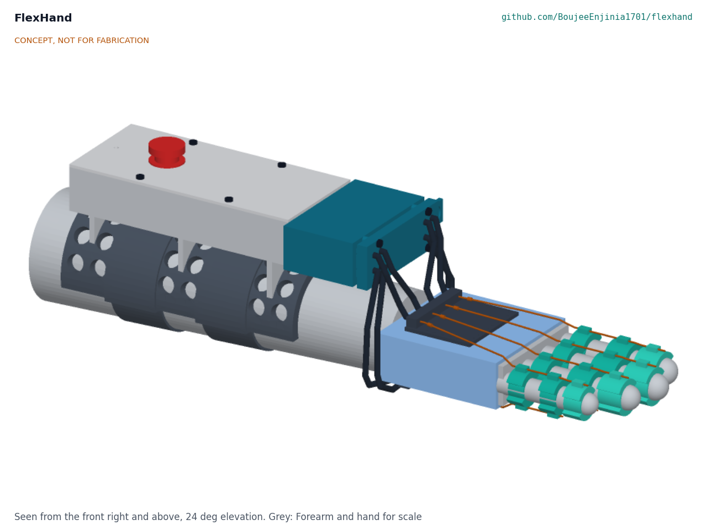
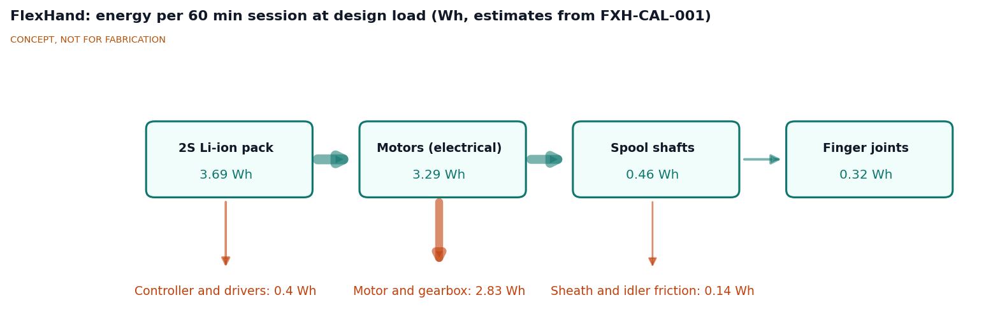
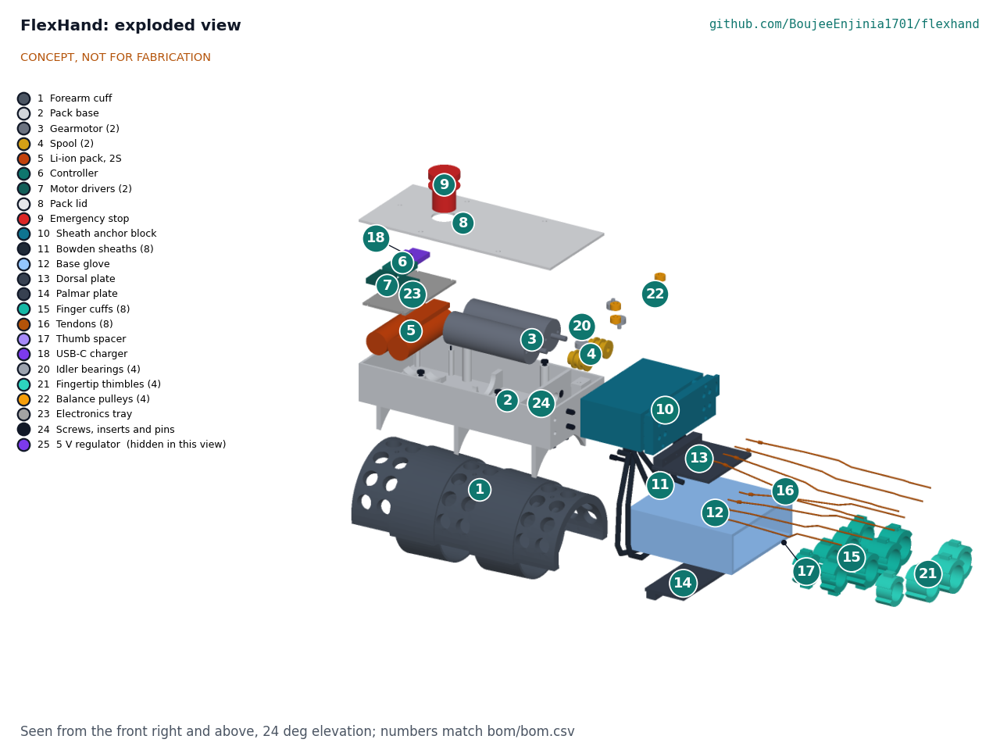
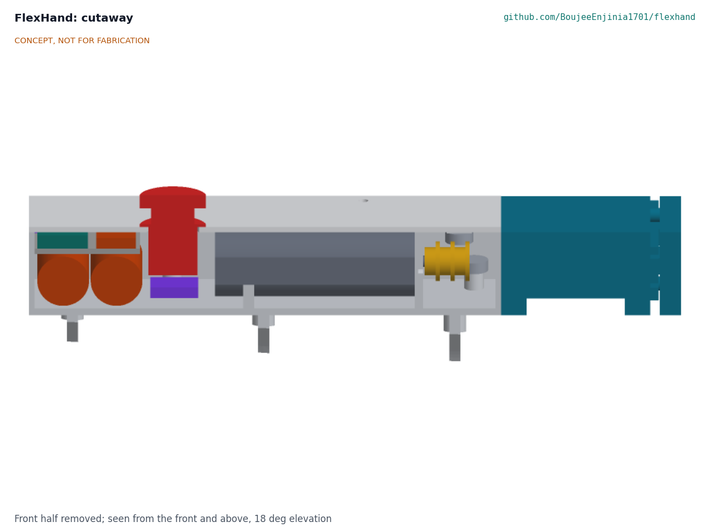

# FlexHand design precis

FlexHand is a fingerless glove with tendon cuffs on the four fingers, driven through Bowden sheaths by two gearmotors in a pack strapped to the forearm. Each motor turns a two-groove spool that pulls a flexor line while paying out the matching extensor line, and a floating balance pulley splits each line between the two fingers of a pair, so one motor moves a pair of fingers both ways with equal tension in each. The extensor load on each finger is shared by a cuff on the middle phalanx and an open-tip thimble on the fingertip. The TRL 3 calculations (FXH-CAL-001 v0.3) give about 445 finger cycles per hour at full speed, about 3.8 sessions of 60 min per charge and cuff pressures of 40 kPa or less on a medium hand. Value-engineering target: USD 500. Estimated cost of the constructable design: USD 303.90 (USD 196.10 under the target). The design misses one requirement: the forearm pack is about 723 g against 450 g (R7). The design is constructable (FXH-DDR-003) and its build is planned in FXH-BLD-001 (`docs/05-build-plan.md`). The force requirement and the force limit are at risk (R2, R3).

*Figure 1. FlexHand on a right forearm and hand, palm down. Device parts are colored; the grey forearm and hand are for scale.*

## How it works

1. **Set up.** A therapist sets range-of-motion end points, stroke time, dwell and force limit for each finger pair. The limits are stored on the controller and cannot be changed from the user's buttons.
2. **Don.** A care partner slides on the fingerless glove, closes the finger cuffs over the proximal and middle phalanges, slides the thimbles onto the fingertips, clips the thumb spacer and straps the pack to the forearm. The tendons clip into the anchor block at the front of the pack.
3. **Cycle.** On start, each gearmotor turns its spool one way to pull the palmar (flexor) tendons and close the fingers, pauses, then turns back to pull the dorsal (extensor) tendons and open them. Each spool line pulls a floating balance pulley in the anchor block, which shares the pull equally between the two finger tendons of the pair. The encoder tracks position against the set end points; a crimped stop bead on each finger tendon limits that finger's travel to its own range if its partner is held back.
4. **Limit.** The motor drivers report current, which is roughly proportional to the combined tendon force of a finger pair. Because the balance pulley keeps both tendons at the same tension, the pair limit is also a per-finger limit. If force passes the limit, the motor stops and backs off. A ball-detent breakaway coupling on each tendon separates if force exceeds about 60 N.
5. **Stop.** A red latching stop button on the pack lid cuts motor power. A red release plate on the anchor block, pulled out by its finger loop, frees all tendons by hand, because the high-ratio gearboxes hold their position when unpowered.
6. **Log.** The controller records session time, cycle count and peak current for the therapist.

*Figure 2. Energy flow for one 60 min session at the design load, in Wh, from FXH-CAL-001. All values are estimates.*

## Main components

Numbers match the exploded view (Figure 3), drawing FXH-DWG-001 and `bom/bom.csv`.

Table 1. Main components.

| # | Component | Choice | Notes |
| --- | --- | --- | --- |
| 1 | Forearm cuff | 3D-printed PETG half shell, 2 mm, perforated with 12 mm holes (33 % open), with a matching 4 mm EVA foam liner and two 38 mm hook-and-loop straps | Spreads the pack load over the dorsal forearm; perforation saves about 25 g and ventilates the skin (N4) |
| 2 | Pack base | 3D-printed PETG, 168 x 76 mm, 2 mm walls, three saddle ribs with screw bosses, motor bulkhead and cradle, cell saddles, idler post and shelf | Screwed to the cuff with six M3 screws (DDR-003) |
| 3 | Gearmotors (2) | 25D x 71L mm, 227:1, 12 V rated, 48 CPR encoder (Pololu 4869), run at 7.2 V | Axes along the forearm at 15 mm each side of center (D1) |
| 4 | Spools (2) | Two-groove spool, 10 mm core, 14 mm flanges, 4 mm set-screw hub, 16 mm long | Flexor wound one way, extensor the other |
| 5 | Li-ion pack | Two 2,500 mAh 18650 cells across the rear of the pack, with 2S protection board | 18 Wh (D8) |
| 6 | Controller | ESP32-S3 module (Seeed XIAO ESP32S3 class) | Limits, logging, optional Bluetooth for the therapist view |
| 7 | Motor drivers (2) | DRV8874 H-bridge with current-sense output | Force limit through motor current |
| 8 | Pack lid | 3D-printed PETG, 2 mm, with stop button opening and LED window | |
| 9 | Emergency stop | 16 mm latching mushroom switch in the motor supply, between the cells and the motors | Hardware cut, not a firmware input |
| 10 | Sheath anchor block | Printed block 53 x 88 x 31 mm with four channels holding the balance pulleys, slack springs and eight ball-detent breakaway couplings; a cover with four sheath pucks; a red pull-out release plate; four slack springs; eight tendon stop beads at the hand end | Tool-free release (R9); ball-detent couplings save 40 g against magnets (N4); layout per DDR-003 |
| 11 | Bowden sheaths (8) | PTFE-lined 4 mm housing, about 80 mm (extensors) and 145 to 165 mm (flexors) | Carry tendons across the wrist so wrist posture does not change finger position much |
| 12 | Base glove | Fingerless, breathable, three sizes | Carries the plates; palm left mostly open |
| 13 | Dorsal plate | TPU 95A, 2.5 mm, with a stop block for the four extensor sheaths; stitched to the glove | |
| 14 | Palmar plate | TPU 95A, 2.5 mm, with a stop block for the four flexor sheaths; stitched to the glove | |
| 15 | Finger cuffs (8) | TPU 95A padded saddles with thin side bands, eyelets and a hook-and-loop closure, 2 mm padded liner: 12 mm guide cuffs on the proximal phalanges, anchor cuffs 12.2 to 18.6 mm wide on the middle phalanges | Anchor cuffs are as wide as the phalanx allows (D4) |
| 16 | Tendons (8) | 0.8 mm braided UHMWPE line | One flexor and one extensor per finger |
| 17 | Thumb spacer | TPU ring and web block, the block stitched to the glove | Holds the thumb abducted, out of the fingers' path (D6) |
| 18 | USB-C charger | 2S charger module in the rear of the pack | Charge only when not worn |
| 19 | Wiring and consumables | Wire, connectors, fasteners | Not modeled |
| 20 | Idler bearings (4) | 623ZZ class, 10 mm, axis vertical | Turn each spool line toward the anchor block |
| 21 | Fingertip thimbles (4) | Open-tip TPU 95A band, 2 mm, with 2 mm padded liner, 13.2 to 19.0 mm wide on the distal phalanges | Shares the extensor load with the anchor cuff; brings every finger under 50 kPa (N2) |
| 22 | Balance pulleys (4) | 693ZZ class, 8 mm, floating in the anchor block channels with 30 mm of travel | One per spool line; equal tension in both fingers of a pair (N3) |
| 23 | Electronics tray | Printed PETG plate over the cells carrying the modules | Holds the cells down (DDR-003) |
| 24 | Fixing kit | Heat-set inserts, M3 and M2.2 screws, 3 mm steel pins | Every joint has a fixing (DDR-003) |
| 25 | 5 V regulator | Step-down module, 5 V 1 A | Supplies the controller, which cannot take the pack voltage (DDR-003) |

Motor 1 drives the index and middle fingers and its sheaths run on the thumb (radial) side; motor 2 drives the ring and little fingers on the ulnar side.

*Figure 3. Exploded view with callouts matching `bom/bom.csv`. Line 19 of the BOM (wiring and consumables) is not modeled.*

*Figure 4. Section through the motor pack on its centerline, seen from the side: cells with the electronics tray above them at the rear (left), the emergency stop, one gearmotor with its spool and idlers, and the anchor block at the front (right). The balance pulleys sit in channels 31.25 mm either side of the section plane and are not cut; the regulator (purple) sits beside the stop button.*

## TRL 3 numbers

All values are estimates from FXH-CAL-001; the tags in brackets are the script's output lines.

Table 2. Key numbers.

| Quantity | Value | Requirement |
| --- | --- | --- |
| Tendon excursion needed, stroke | 24.8 mm, 29.8 mm [A1], [A2] | R1 met |
| Design load | 30 N per finger; a MAS 1+ finger needs about 18 N [B1] | R2 restated for mild tone (N1) |
| Transmission efficiency | 0.659 (0.445 pessimistic), with the balance pulley [C1] | |
| Peak spool torque | 0.492 N·m, 125 % of the gearbox's continuous rating, 63 % of intermittent; RMS 0.269 N·m [C2], [C4] | R2 at risk |
| Force limit | 0.57 A trip; 40 N per finger with the balance pulley; 27 to 47 N friction spread [E1] to [E3] | R3 at risk |
| Stroke and cycle | Extension 3.31 s, flexion 2.78 s, cycle 8.08 s [D2] | R5 met (4 to 15 s at design load) |
| Repetitions | 445 per hour at full speed; 360 at 4 s strokes [D3], [D5] | R4 met |
| Energy per session | 3.80 Wh; 3.8 sessions per 18 Wh charge [F2], [F3] | R6 met |
| Mass on the hand | 117 g [G4] | R7 hand part met |
| Mass of forearm pack | 723 g [G2] | **R7 not met** |
| Cuff and thimble contact pressure | 23 to 40 kPa medium hand; 46 kPa worst on a small hand [H2], [H3] | R11 met on paper |
| Stop time | About 11 ms [I1] | R9 not verifiable at TRL 3 |
| Parts cost | USD 303.90 [J1] | R12: USD 196.10 under the USD 500 value-engineering target |

## Key design choices

Amish decided D1 to D8 on 2026-09-25 (FXH-DDR-001) by accepting the TRL 2 recommendations, and N1 to N5 later the same day by accepting the TRL 3 recommendations (FXH-DDR-002).

- **Tendons and Bowden sheaths rather than pneumatic soft actuators (D7).** Tendons need no pump or valves, run from a small battery and keep the hand light. The Columbia orthosis and Exo-Glove Poly show that tendon drives work for this task.
- **Two motors, one per finger pair, each with an antagonistic spool (D2).** One motor per pair moves the fingers both ways. Flexor and extensor excursions differ by about 1.2 mm, which a slack spring on each tendon in the anchor block takes up.
- **25 mm gearmotors on the forearm (D1).** The micro (N20) route could not carry the torque, and a bench-top unit departs from the wrist-mounted pitch. The 25 mm motors are the main cause of the R7 overrun, and the 450 g target is to be revisited with a therapist.
- **Motors along the forearm (TRL 3 layout).** At TRL 2 the motors lay across the forearm, but a 71 mm gearmotor with its spool needs about 84 mm, which forced a pack wider than the forearm. Turning the motors to lie along the forearm, with the spools at the front and a small idler turning each tendon pair forward, gives a 76 mm wide pack. The idlers cost about 5 % in efficiency.
- **Passive motion only (D3).** An active-assist mode triggered by the user's own effort is recorded as a later option; it is not part of this design.
- **Anchor cuffs as wide as the phalanx allows (D4), plus a fingertip thimble (N2).** The 20 mm cuff recommended at TRL 2 does not fit on any middle phalanx with clearance for PIP flexion. The extensor tendon runs on past the anchor cuff to an open-tip thimble on the distal phalanx, so the two share the load and the worst pressure falls from 84 to 40 kPa. The thimble is open at the tip to keep the fingertip free and to save mass.
- **Balance pulleys (N3).** A floating pulley on each spool line makes both fingers of a pair carry equal tension, so the current limit acts per finger (worst case 40 N, was 80 N). It costs about 5 % in efficiency and lengthens the anchor block from 12 to 44 mm (53 mm in the constructable design, which also holds the couplings and springs). A stop bead on each finger tendon keeps a free finger within its range when its partner is held back.
- **Lighter pack parts (N4).** Ball-detent breakaways and a perforated cuff save about 65 g. The pack is still about 723 g in the constructable design (639 g before the fixings, bulkhead, tray and longer anchor block were added); the 450 g target is to be reviewed with a therapist once a co-design partner is chosen (O1).
- **Mild tone first, 4 s lower stroke limit (N1, N5).** R2 names mild flexor tone (MAS 1 to 1+), which the 30 N design load covers. The lower stroke limit at design load is 4 s, which the drive reaches even with pessimistic friction and which is gentler on the joints.
- **Thumb passive (D6).** A spacer holds the thumb abducted.
- **Force limiting in three layers.** Firmware current limit, a mechanical breakaway coupling on each tendon, and a hardware stop switch with a manual tendon release.
- **2S Li-ion pack (D8).** Enough for about 3.9 sessions and charged by USB-C. The portfolio's 48 V SwapCell pack is far larger than needed and is not used.

## Safety

> **Safety:** FlexHand is a research and educational prototype. It is not a medical device, has not been cleared or approved by any regulator, and must not be used to diagnose or treat any person. Any use on a person needs a supervising therapist, informed consent and, in a research setting, ethics review.

- **Joint injury.** Forcing a spastic or contracted finger can injure joints, tendons or skin. Range limits and force limits are set by a therapist, start low, and are enforced in firmware with a mechanical breakaway as backup. Movement is slow (30 °/s or less; about 28 °/s at the PIP at the fastest setting) to avoid provoking a stretch reflex. The balance pulleys hold both fingers of a pair to the same tension, but sheath friction still spreads the real force from about 27 to 47 N at a 40 N setting (R3 at risk). If one finger is held back, the balance pulley lets its partner move further; the stop bead on each tendon must be set to that finger's range before use.
- **Reduced sensation.** Many users cannot feel pressure or pain in the affected hand. Check the skin under every cuff before and after each session, and stop at any redness that does not fade within 30 min. R11 is met only on paper, under an assumed load sharing between cuff and thimble, so this design must not be worn until pressure has been mapped on a bench.
- **Entrapment.** The gearboxes hold their position when unpowered. If power fails with the fingers flexed, the hand stays closed until the tendons are released. The release plate and a care partner within reach are required.
- **Pinch points and moving parts.** Spools, idlers and tendons are inside the pack; keep the lid closed while powered. Keep hair and loose clothing away from the tendon path.
- **Lithium-ion cells.** Use a protected 2S pack, charge only when not worn, on a non-combustible surface, and stop using a pack that is swollen, damaged or hot.
- **Electrical.** The pack runs at 8.4 V or less; there is no mains connection while worn.
- **Data.** Session logs are health data. Keep them on the device and the therapist's computer; share only with consent.

## Constructable design

Drawing the build plan showed parts of the concept that could not be made or fixed as drawn. FXH-DDR-003 records the changes made under Amish's 2026-09-30 instruction to make the design physically buildable: the pack is screwed to the cuff, the motors are held by a printed bulkhead, the electronics sit on a tray with a 5 V regulator added, the anchor block is 53 mm long with room for its pulleys, couplings and springs, the quick release is a pull-out plate, and the finger cuffs are padded saddles that fit side by side. What FlexHand does is unchanged.

## Open questions

Open decisions are listed in the design decisions register (`docs/06-design-decisions.md`, FXH-DEC-001), among them the first clinical co-design partner (O1) and the review of the design-for-construction changes.

Concept media: [blueprint sheet](../media/concept-blueprint.pdf), [interactive 3D model](../media/viewer.html). General arrangement: [FXH-DWG-001](../cad/drawings/FXH-DWG-001.pdf).
